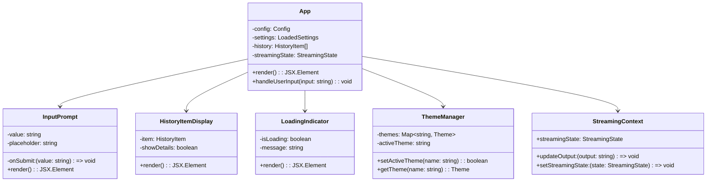

# Gemini CLI 组件交互 UML 图

## 1. 核心类图 (Core Class Diagram)

## 2. 工具系统交互图 (Tool System Interaction)

## 3. 认证系统类图 (Authentication System)

## 4. MCP 集成系统 (MCP Integration System)

## 5. 用户界面组件关系 (UI Component Relations)

## 组件交互说明

### 1. 核心交互流程
- **Config** 作为中央配置管理器，协调各个组件
- **GeminiChat** 管理与AI的对话状态和历史
- **ToolRegistry** 统一管理和调度所有工具
- **ContentGenerator** 处理AI内容生成和工具调用

### 2. 工具系统设计
- **BaseTool** 提供统一的工具接口
- **ModifiableTool** 标识需要用户确认的工具
- **ToolExecutor** 负责工具调用的生命周期管理

### 3. 认证系统架构
- **AuthManager** 统一管理多种认证方式
- 支持OAuth2、API密钥、Vertex AI等多种认证
- 与GeminiClient紧密集成

### 4. MCP集成特点
- 支持多种传输协议（stdio、SSE、HTTP）
- 动态发现和注册MCP工具
- 状态管理和错误处理

### 5. UI组件架构
- 基于React和Ink构建的终端UI
- 流式输出和实时更新支持
- 主题系统和用户体验优化