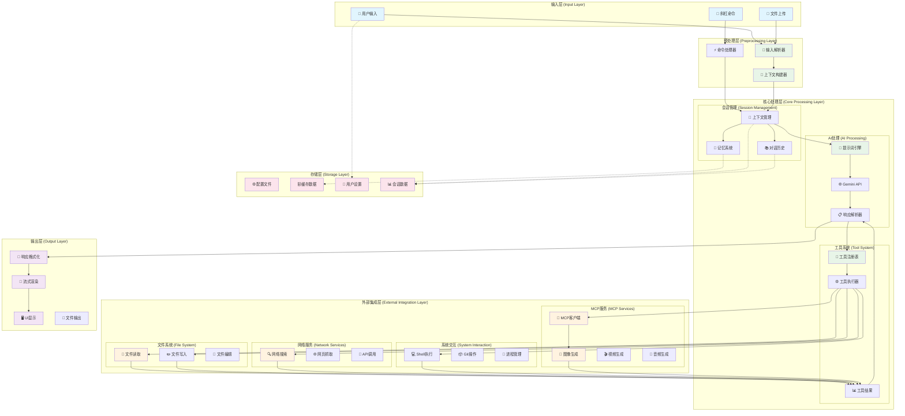
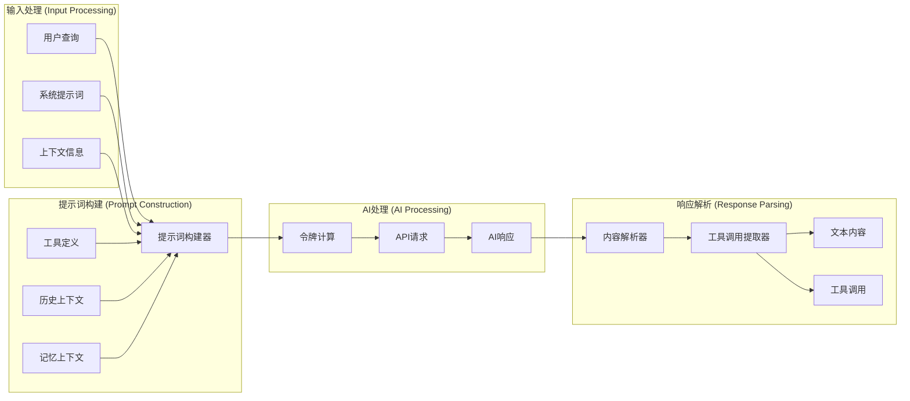
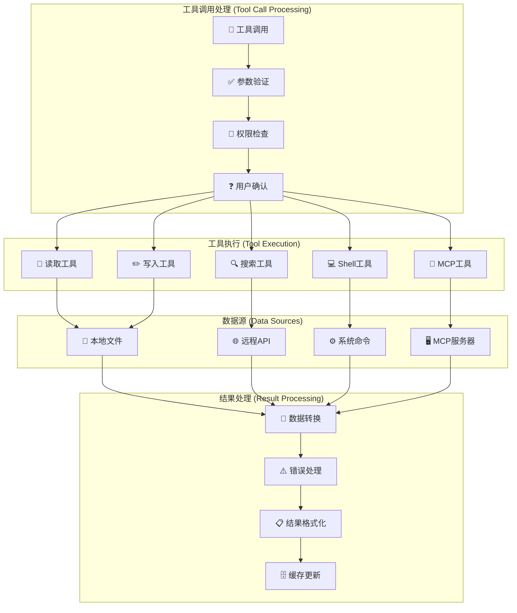
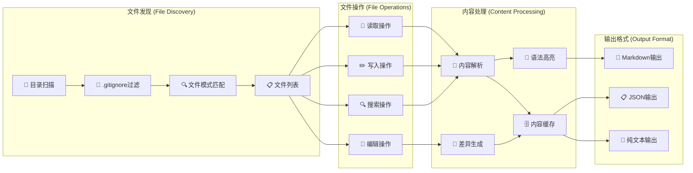
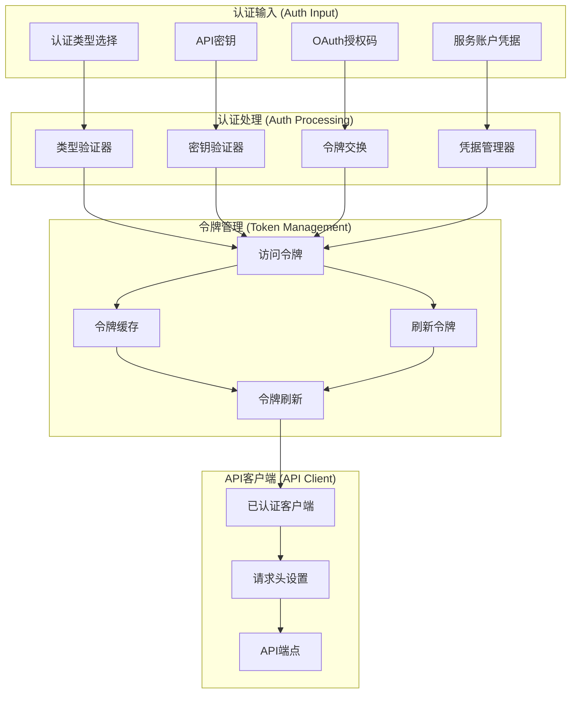
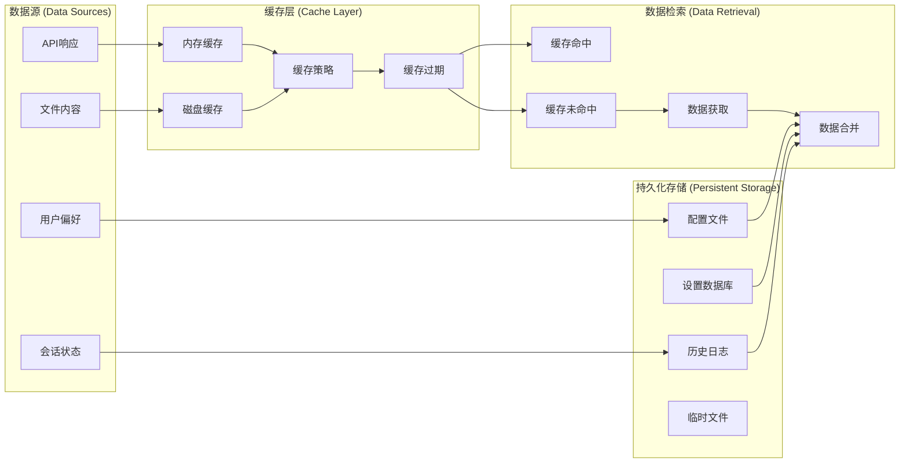

# Gemini CLI 数据流程图

## 1. 整体数据流架构 (Overall Data Flow Architecture)

## 2. 提示词处理数据流 (Prompt Processing Data Flow)

## 3. 工具执行数据流 (Tool Execution Data Flow)

## 4. 文件系统数据流 (File System Data Flow)

## 5. 认证数据流 (Authentication Data Flow)

## 6. 缓存与存储数据流 (Cache and Storage Data Flow)

## 数据流特点说明

### 1. 分层数据处理
- **输入层**：统一处理各种用户输入
- **预处理层**：解析和验证输入数据
- **核心处理层**：AI推理和工具调度
- **集成层**：外部系统和服务交互
- **输出层**：格式化和渲染结果

### 2. 数据转换管道
- **结构化数据**：JSON、配置文件等结构化数据
- **文本数据**：自然语言、代码、文档等文本内容
- **二进制数据**：图像、音频、视频等媒体文件
- **流式数据**：实时响应和更新数据

### 3. 缓存策略
- **多层缓存**：内存缓存 + 磁盘缓存
- **智能过期**：基于时间和访问模式的缓存策略
- **数据一致性**：确保缓存与源数据的一致性

### 4. 错误处理
- **数据验证**：输入数据的格式和有效性检查
- **异常恢复**：网络错误、API限制等异常情况处理
- **降级策略**：服务不可用时的备选方案

### 5. 性能优化
- **并行处理**：独立数据流的并行处理
- **批量操作**：合并相似操作减少开销
- **流式处理**：大数据量的流式处理机制