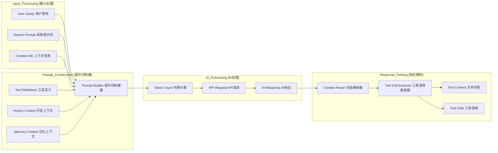
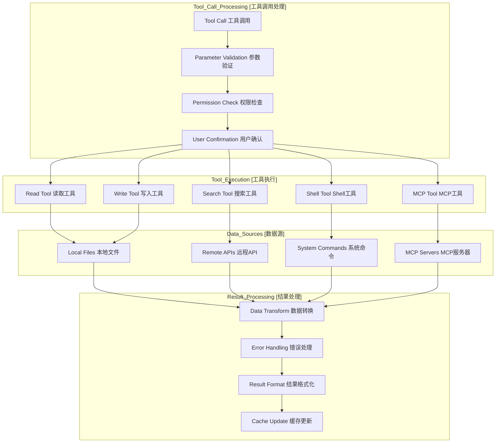
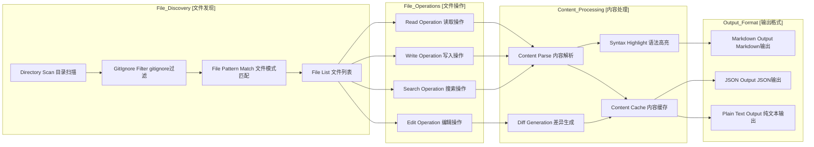
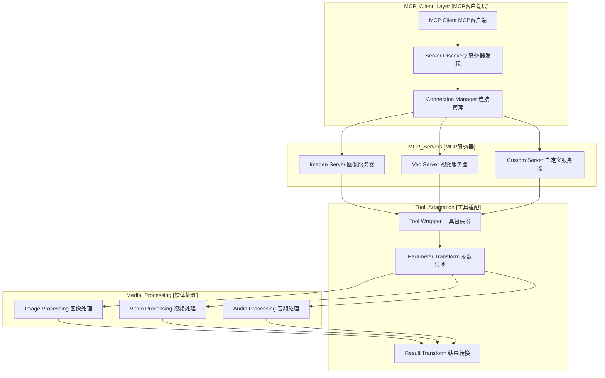

# Gemini CLI 数据流程图

## 1. 整体数据流架构 (Overall Data Flow Architecture)

```mermaid
flowchart TD
    subgraph "Input_Layer [输入层]"
        UserInput[User Input 用户输入]
        SlashCmd[Slash Commands 斜杠命令]
        FileUpload[File Upload 文件上传]
    end

    subgraph "Preprocessing_Layer [预处理层]"
        InputParser[Input Parser 输入解析器]
        CmdProcessor[Command Processor 命令处理器]
        ContextBuilder[Context Builder 上下文构建器]
    end

    subgraph "Core_Processing_Layer [核心处理层]"
        subgraph "Session_Management [会话管理]"
            History[History 对话历史]
            Memory[Memory System 记忆系统]
            Context[Context Management 上下文管理]
        end
        
        subgraph "AI_Processing [AI处理]"
            PromptEngine[Prompt Engine 提示词引擎]
            GeminiAPI[Gemini API]
            ResponseParser[Response Parser 响应解析器]
        end
        
        subgraph "Tool_System [工具系统]"
            ToolRegistry[Tool Registry 工具注册表]
            ToolExecutor[Tool Executor 工具执行器]
            ToolResult[Tool Result 工具结果]
        end
    end

    subgraph "External_Integration_Layer [外部集成层]"
        FileRead[File Read 文件读取]
        FileWrite[File Write 文件写入]
        FileEdit[File Edit 文件编辑]
        
        WebSearch[Web Search 网络搜索]
        WebFetch[Web Fetch 网页抓取]
        APICall[API Call API调用]
        
        ShellExec[Shell Execute Shell执行]
        GitOps[Git Operations Git操作]
        ProcessMgmt[Process Management 进程管理]
        
        MCPClient[MCP Client MCP客户端]
        ImageGen[Image Generation 图像生成]
        VideoGen[Video Generation 视频生成]
        AudioGen[Audio Generation 音频生成]
    end

    subgraph "Output_Layer [输出层]"
        ResponseFormatter[Response Formatter 响应格式化]
        StreamRenderer[Stream Renderer 流式渲染]
        UIDisplay[UI Display UI显示]
        FileOutput[File Output 文件输出]
    end

    subgraph "Storage_Layer [存储层]"
        ConfigFiles[Config Files 配置文件]
        CacheData[Cache Data 缓存数据]
        UserSettings[User Settings 用户设置]
        SessionData[Session Data 会话数据]
    end

    %% Data Flow Connections
    UserInput --> InputParser
    SlashCmd --> CmdProcessor
    FileUpload --> InputParser
    
    InputParser --> ContextBuilder
    CmdProcessor --> Context
    ContextBuilder --> Context
    
    Context --> History
    Context --> Memory
    Context --> PromptEngine
    
    PromptEngine --> GeminiAPI
    GeminiAPI --> ResponseParser
    ResponseParser --> ToolRegistry
    
    ToolRegistry --> ToolExecutor
    ToolExecutor --> FileRead
    ToolExecutor --> FileWrite
    ToolExecutor --> WebSearch
    ToolExecutor --> ShellExec
    ToolExecutor --> MCPClient
    
    FileRead --> ToolResult
    FileWrite --> ToolResult
    WebSearch --> ToolResult
    ShellExec --> ToolResult
    MCPClient --> ImageGen
    ImageGen --> ToolResult
    
    ToolResult --> ResponseParser
    ResponseParser --> ResponseFormatter
    ResponseFormatter --> StreamRenderer
    StreamRenderer --> UIDisplay
    
    %% Storage Connections
    Context -.-> SessionData
    Memory -.-> CacheData
    UserInput -.-> UserSettings
    History -.-> SessionData
    
    %% Styling
    classDef inputLayer fill:#e1f5fe,stroke:#01579b
    classDef processingLayer fill:#e8f5e8,stroke:#1b5e20
    classDef integrationLayer fill:#fff3e0,stroke:#e65100
    classDef outputLayer fill:#f3e5f5,stroke:#4a148c
    classDef storageLayer fill:#fce4ec,stroke:#880e4f
    
    class UserInput,SlashCmd,FileUpload inputLayer
    class InputParser,ContextBuilder,PromptEngine,ToolRegistry processingLayer
    class FileRead,WebSearch,MCPClient,ImageGen integrationLayer
    class ResponseFormatter,StreamRenderer,UIDisplay outputLayer
    class ConfigFiles,CacheData,UserSettings,SessionData storageLayer
```

## 2. 提示词处理数据流 (Prompt Processing Data Flow)

## 3. 工具执行数据流 (Tool Execution Data Flow)

## 4. 文件系统数据流 (File System Data Flow)

## 5. MCP集成数据流 (MCP Integration Data Flow)

## 数据流特点说明

### 1. 异步处理
- 支持流式响应和实时更新
- 工具执行采用异步模式
- 支持长时间运行的任务

### 2. 错误处理
- 多层次错误处理机制
- 优雅降级和回退策略
- 详细的错误日志和追踪

### 3. 缓存策略
- 智能缓存文件内容
- 会话数据持久化
- 工具执行结果缓存

### 4. 安全控制
- 工具执行权限检查
- 用户确认机制
- 沙箱环境隔离

### 5. 扩展性
- 模块化的工具系统
- 可插拔的MCP服务
- 灵活的配置管理

这个数据流架构确保了 Gemini CLI 能够高效、安全地处理各种复杂的用户请求，同时提供良好的扩展性和维护性。