# Gemini CLI 系统架构图

```mermaid
graph TB
    subgraph "User_Layer [用户层]"
        U[Terminal 用户终端]
        CMD[CLI Commands 命令行输入]
    end

    subgraph "CLI_Package [CLI包 packages/cli]"
        subgraph "UI_Layer [用户界面层]"
            APP[App.tsx 主应用组件]
            UI[UI Components]
            THEME[Theme Manager 主题管理]
            INPUT[Input Handler 输入处理]
        end
        
        subgraph "Config_Management [配置管理]"
            CONFIG[Config Loader 配置加载]
            SETTINGS[Settings Manager 设置管理]
            AUTH_CLI[Auth Config 认证配置]
        end
        
        subgraph "Lifecycle [启动与生命周期]"
            MAIN[main 主入口]
            GEMINI_TSX[gemini.tsx]
            LIFECYCLE[Lifecycle Manager 生命周期管理]
        end
    end

    subgraph "Core_Package [Core包 packages/core]"
        subgraph "Core_Engine [核心引擎]"
            CLIENT[Gemini Client]
            CHAT[GeminiChat 会话管理]
            CONTENT_GEN[ContentGenerator 内容生成器]
            REQUEST[GeminiRequest 请求处理]
        end
        
        subgraph "Tools_System [工具系统]"
            TOOL_REG[ToolRegistry 工具注册中心]
            
            READ_FILE[ReadFileTool 读取文件]
            WRITE_FILE[WriteFileTool 写入文件]
            EDIT_TOOL[EditTool 编辑工具]
            LS_TOOL[LSTool 目录列表]
            GREP_TOOL[GrepTool 文本搜索]
            WEB_SEARCH[WebSearchTool 网络搜索]
            SHELL_TOOL[ShellTool Shell命令]
            MEMORY_TOOL[MemoryTool 记忆工具]
            MCP_CLIENT[MCPClient MCP客户端]
        end
        
        subgraph "Services [服务层]"
            FILE_DISCOVERY[File Discovery Service]
            GIT_SERVICE[Git Service]
            MEMORY_SERVICE[Memory Service]
        end
        
        subgraph "Auth_Security [认证与安全]"
            AUTH_CORE[Auth Core 认证核心]
            OAUTH[OAuth2 Handler]
            API_KEY[API Key Manager]
            VERTEX_AI[Vertex AI Integration]
        end
    end

    subgraph "External_Services [外部服务]"
        GEMINI_API[Gemini API]
        VERTEX_API[Vertex AI API]
        SEARCH_API[Google Search API]
        
        IMAGEN[Imagen MCP Server]
        VEO[Veo MCP Server] 
        CUSTOM_MCP[Custom MCP Server]
        
        FILE_SYS[File System 文件系统]
        SHELL[System Shell]
        GIT_REPO[Git Repository]
    end

    subgraph "Config_Data [配置与数据]"
        ENV_CONFIG[Environment Config .env]
        GEMINI_CONFIG[Gemini Config .gemini/]
        MEMORY_FILES[Memory Files]
        HISTORY[Session History]
    end

    %% User Interaction Flow
    U --> CMD
    CMD --> APP
    APP --> UI
    UI --> INPUT
    
    %% CLI to Core Communication
    APP --> CLIENT
    CONFIG --> AUTH_CORE
    SETTINGS --> AUTH_CORE
    
    %% Core Internal Flow
    CLIENT --> CHAT
    CHAT --> CONTENT_GEN
    CONTENT_GEN --> REQUEST
    REQUEST --> GEMINI_API
    
    %% Tools System Flow
    CHAT --> TOOL_REG
    TOOL_REG --> READ_FILE
    TOOL_REG --> WRITE_FILE
    TOOL_REG --> EDIT_TOOL
    TOOL_REG --> SHELL_TOOL
    TOOL_REG --> WEB_SEARCH
    TOOL_REG --> MCP_CLIENT
    
    %% MCP Integration
    MCP_CLIENT --> IMAGEN
    MCP_CLIENT --> VEO
    MCP_CLIENT --> CUSTOM_MCP
    
    %% External Services
    WEB_SEARCH --> SEARCH_API
    AUTH_CORE --> VERTEX_API
    OAUTH --> GEMINI_API
    
    %% System Resources
    READ_FILE --> FILE_SYS
    WRITE_FILE --> FILE_SYS
    SHELL_TOOL --> SHELL
    GIT_SERVICE --> GIT_REPO
    
    %% Configuration Data Flow
    ENV_CONFIG --> CONFIG
    GEMINI_CONFIG --> SETTINGS
    MEMORY_FILES --> MEMORY_SERVICE
    HISTORY --> CHAT

    %% Styling
    classDef userLayer fill:#e1f5fe,stroke:#01579b
    classDef cliLayer fill:#f3e5f5,stroke:#4a148c
    classDef coreLayer fill:#e8f5e8,stroke:#1b5e20
    classDef externalLayer fill:#fff3e0,stroke:#e65100
    classDef configLayer fill:#fce4ec,stroke:#880e4f
    
    class U,CMD userLayer
    class APP,UI,CONFIG,SETTINGS,AUTH_CLI,MAIN cliLayer
    class CLIENT,CHAT,TOOL_REG,AUTH_CORE coreLayer
    class GEMINI_API,VERTEX_API,SEARCH_API,FILE_SYS,SHELL externalLayer
    class ENV_CONFIG,GEMINI_CONFIG,MEMORY_FILES,HISTORY configLayer
```

## 架构说明

### 1. 分层架构
- **用户层**: 终端用户界面和命令输入
- **CLI包**: 用户界面、配置管理、应用生命周期
- **Core包**: 核心业务逻辑、工具系统、AI交互
- **外部服务**: Google AI服务、MCP服务器、系统资源
- **配置数据**: 环境配置、用户设置、会话数据

### 2. 核心组件
- **GeminiChat**: 管理与AI模型的对话会话
- **ToolRegistry**: 统一的工具注册和调度系统
- **ContentGenerator**: 处理AI内容生成请求
- **MCPClient**: Model Context Protocol 客户端集成

### 3. 工具生态系统
- **文件系统工具**: 文件读写、编辑、目录操作
- **搜索工具**: 文本搜索、网络搜索、内容获取
- **系统工具**: Shell命令执行、记忆管理
- **MCP集成**: 支持多媒体生成和外部服务

### 4. 认证体系
- **多重认证**: OAuth2、API密钥、Vertex AI
- **安全管理**: 凭证存储、权限控制
- **环境适配**: 支持多种部署环境