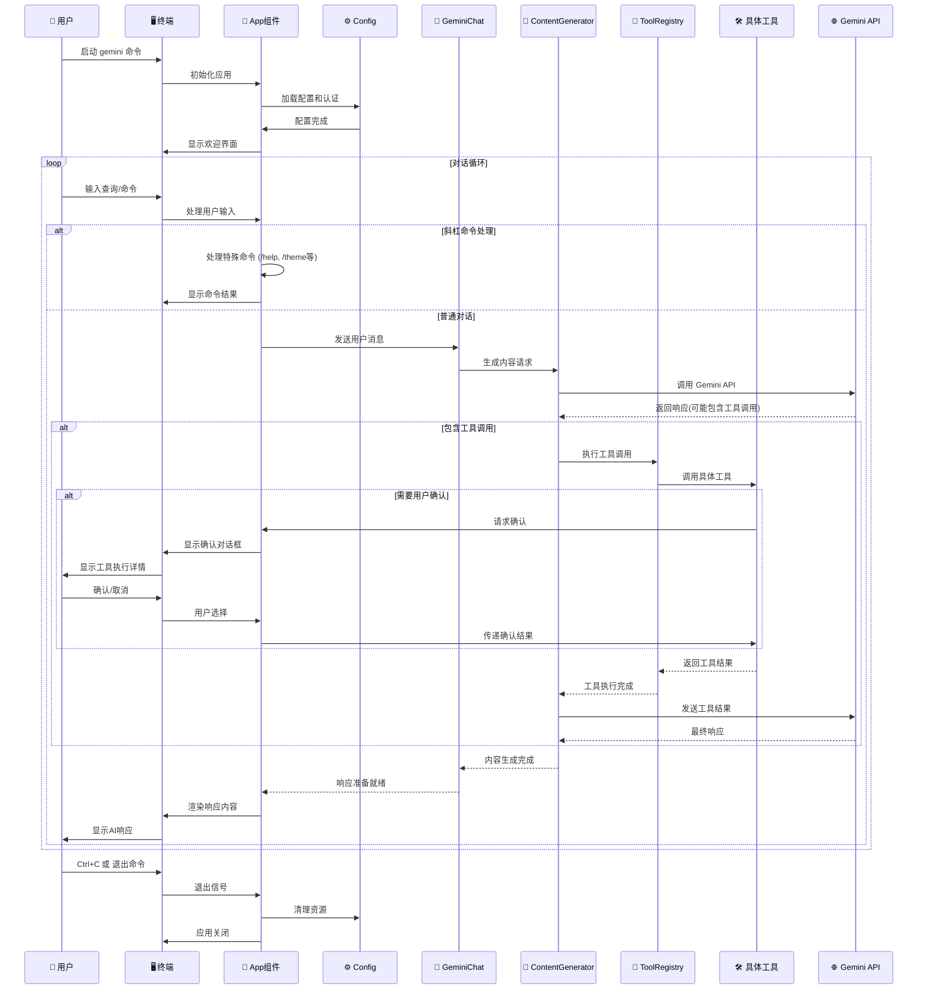
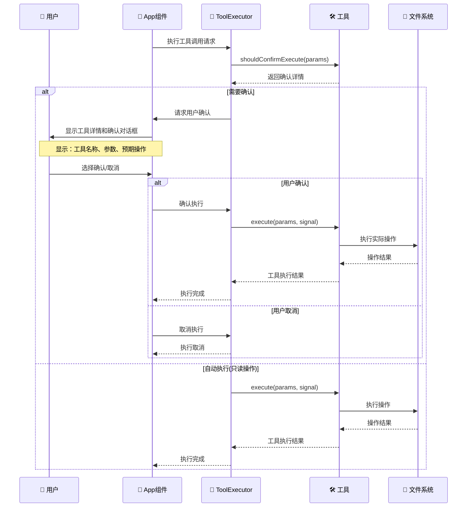
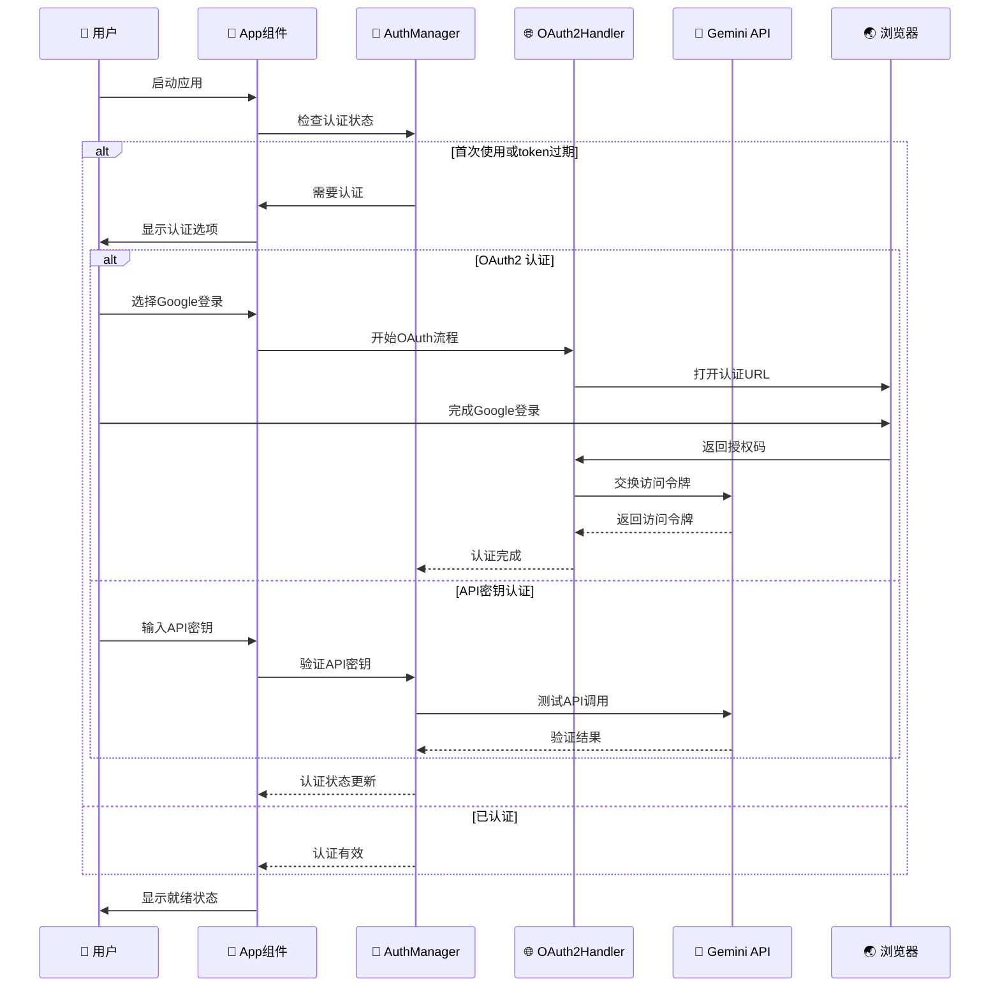
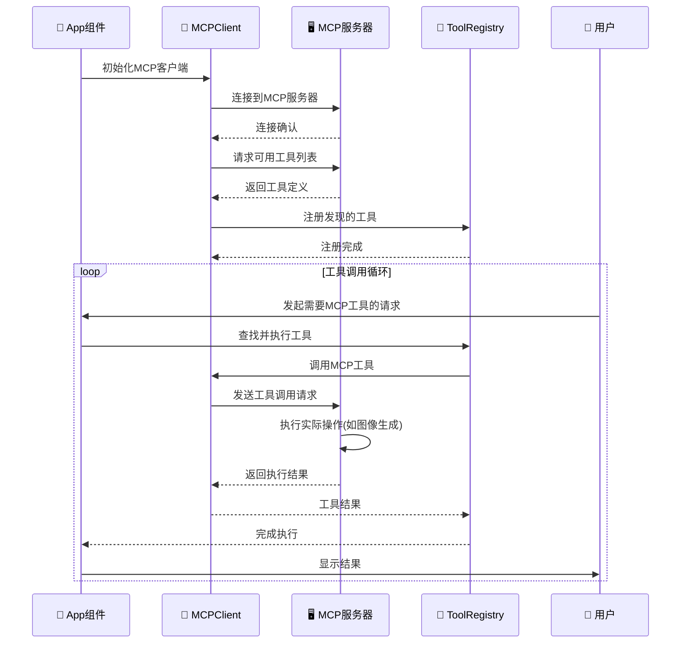
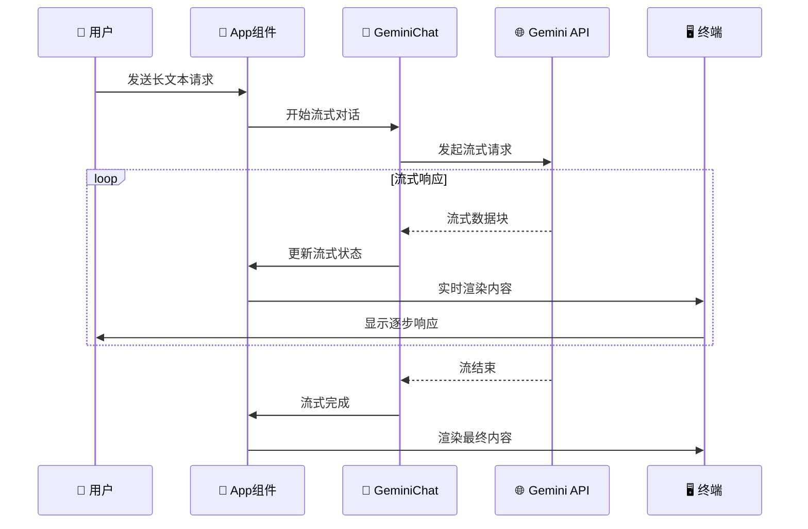
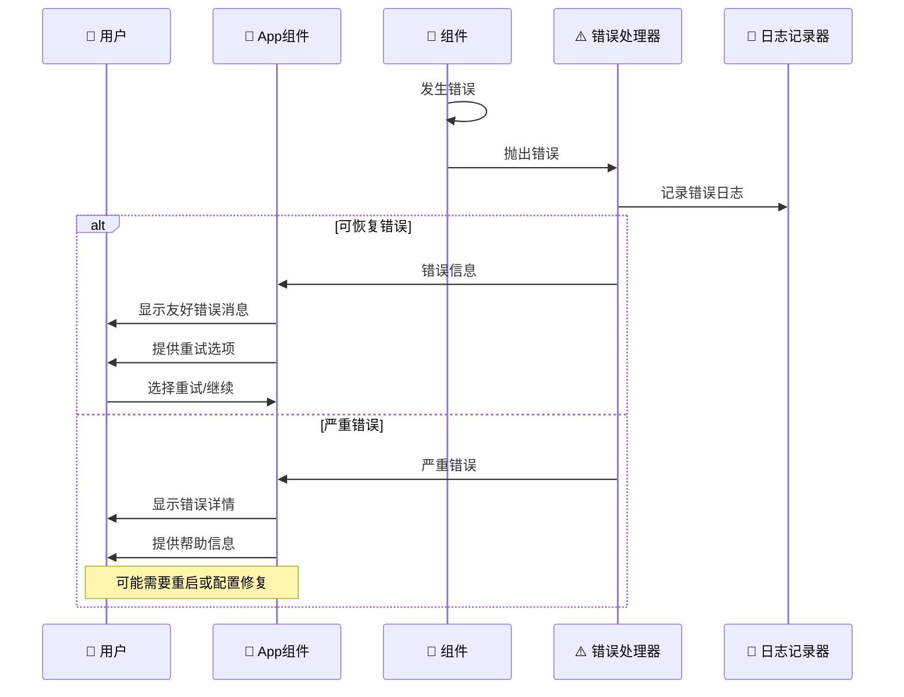

# Gemini CLI 用户交互时序图

## 1. 完整用户对话流程 (Complete User Conversation Flow)

## 2. 工具调用确认流程 (Tool Call Confirmation Flow)

## 3. 认证流程 (Authentication Flow)

## 4. MCP 服务器集成流程 (MCP Server Integration Flow)

## 5. 流式响应处理 (Streaming Response Handling)

## 6. 错误处理流程 (Error Handling Flow)

## 交互流程说明

### 1. 用户体验设计原则
- **即时反馈**：用户输入后立即显示处理状态
- **流式渲染**：长响应内容逐步显示，提升感知性能
- **确认机制**：危险操作需要用户明确确认
- **错误恢复**：友好的错误提示和恢复建议

### 2. 工具调用安全机制
- **权限分级**：只读操作自动执行，修改操作需要确认
- **详细预览**：显示工具将要执行的具体操作
- **取消机制**：用户可以随时取消工具执行

### 3. 认证流程特点
- **多种方式**：支持OAuth2、API密钥等多种认证
- **状态管理**：持久化认证状态，避免重复登录
- **安全存储**：安全存储认证凭据

### 4. MCP集成优势
- **动态发现**：自动发现和注册MCP工具
- **透明调用**：MCP工具与内置工具统一接口
- **错误处理**：完善的MCP连接和执行错误处理

### 5. 流式处理优化
- **渐进式渲染**：长响应内容逐步显示
- **用户体验**：避免长时间等待的感觉
- **资源管理**：高效的内存和网络资源使用