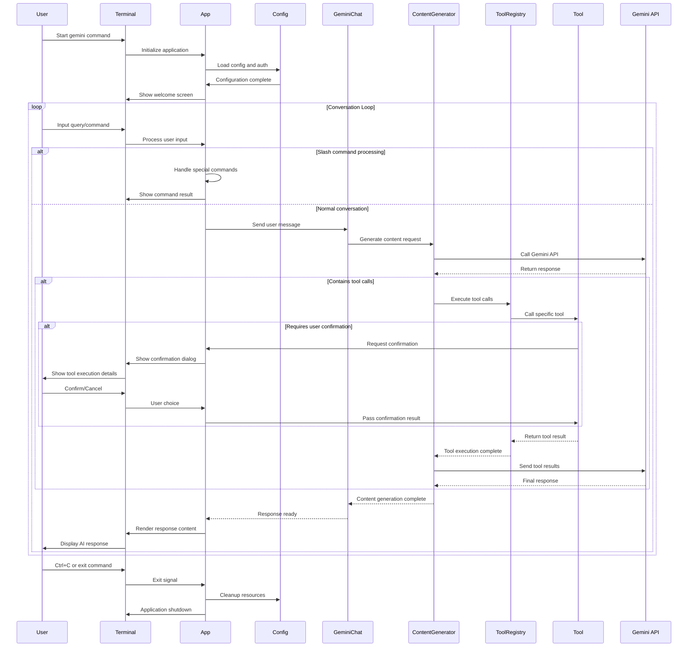
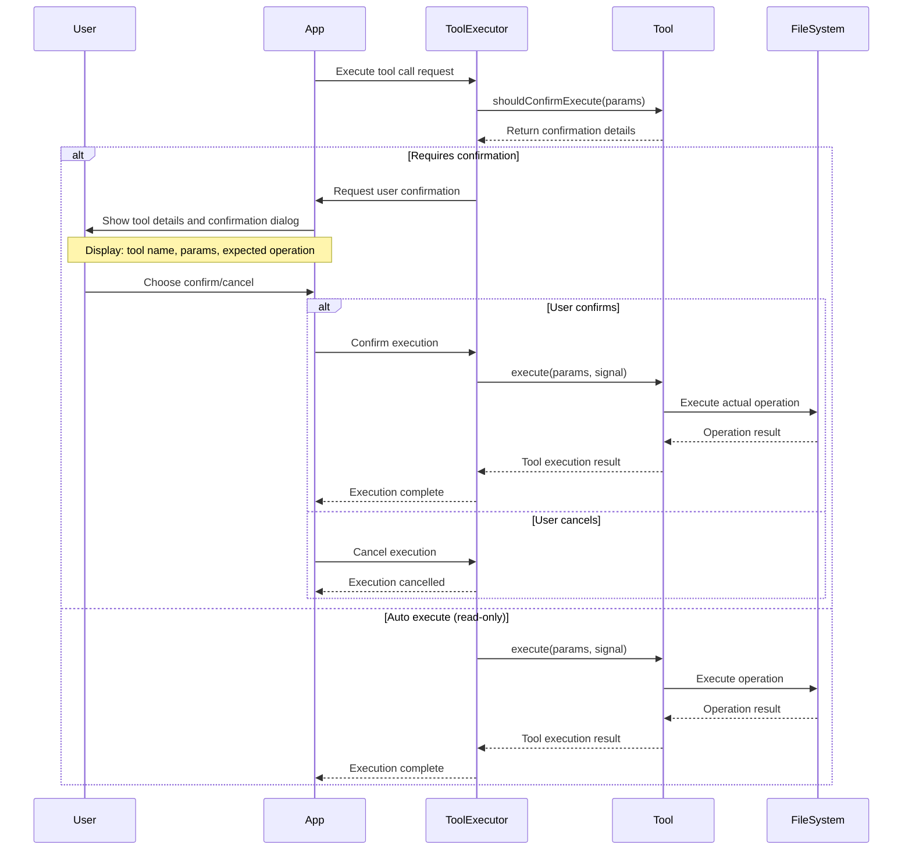
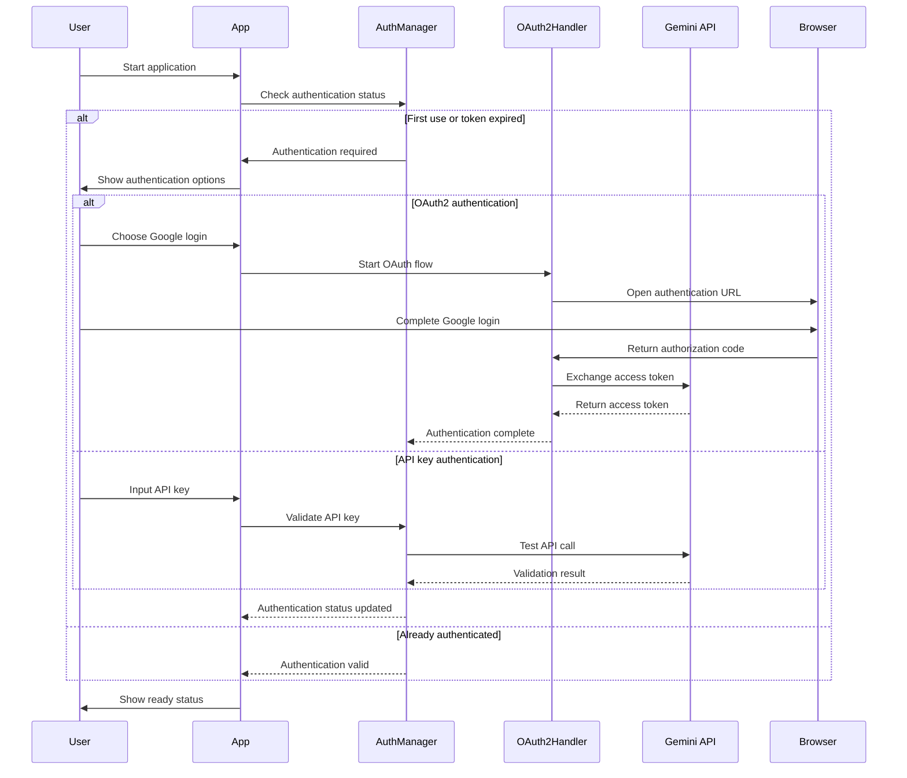
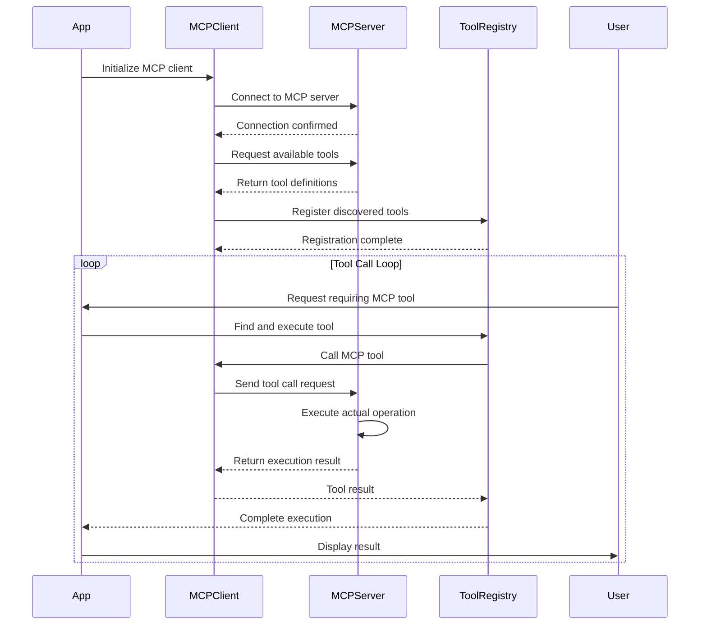
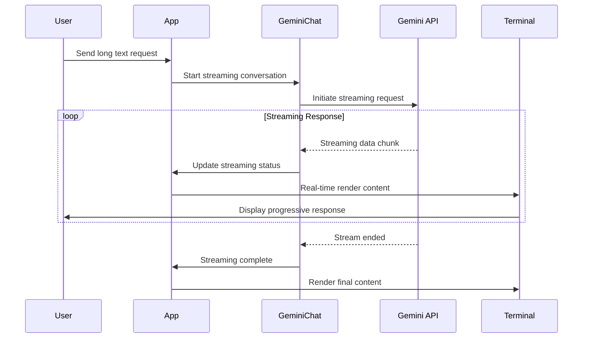
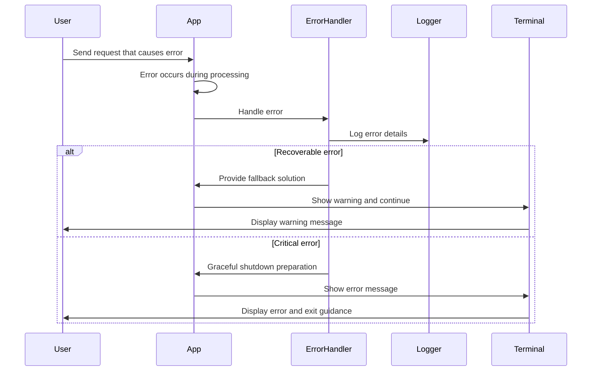

# Gemini CLI 用户交互时序图

## 1. 完整用户对话流程 (Complete User Conversation Flow)

## 2. 工具调用确认流程 (Tool Call Confirmation Flow)

## 3. 认证流程 (Authentication Flow)

## 4. MCP 服务器集成流程 (MCP Server Integration Flow)

## 5. 流式响应处理 (Streaming Response Handling)

## 6. 错误处理流程 (Error Handling Flow)

## 交互特点说明

### 1. 异步处理
- 支持非阻塞的用户交互
- 流式响应提供实时反馈
- 工具执行可以并行处理

### 2. 用户确认机制
- 危险操作需要显式确认
- 提供详细的操作预览
- 支持操作取消和回滚

### 3. 错误恢复
- 多层次错误处理策略
- 优雅降级和用户指导
- 详细的错误日志记录

### 4. 扩展性设计
- 模块化的组件交互
- 标准化的工具接口
- 可插拔的MCP服务集成

### 5. 用户体验优化
- 清晰的状态反馈
- 响应式的界面更新
- 直观的操作流程

这些交互时序图展示了 Gemini CLI 如何通过精心设计的用户交互流程，提供高效、安全、用户友好的AI助手体验。