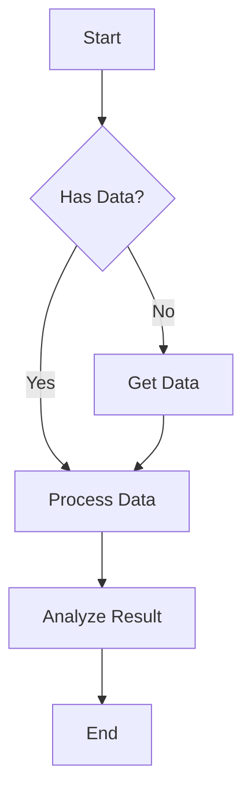
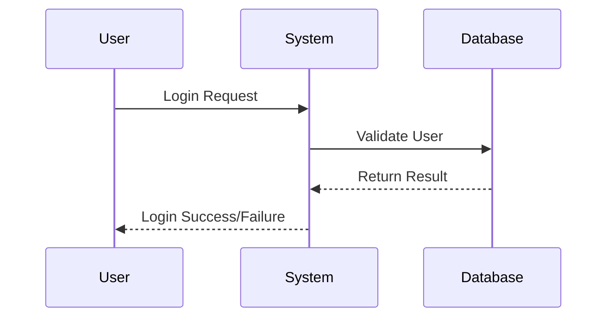
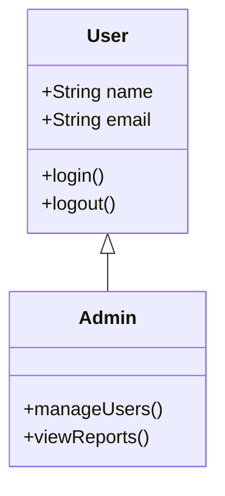
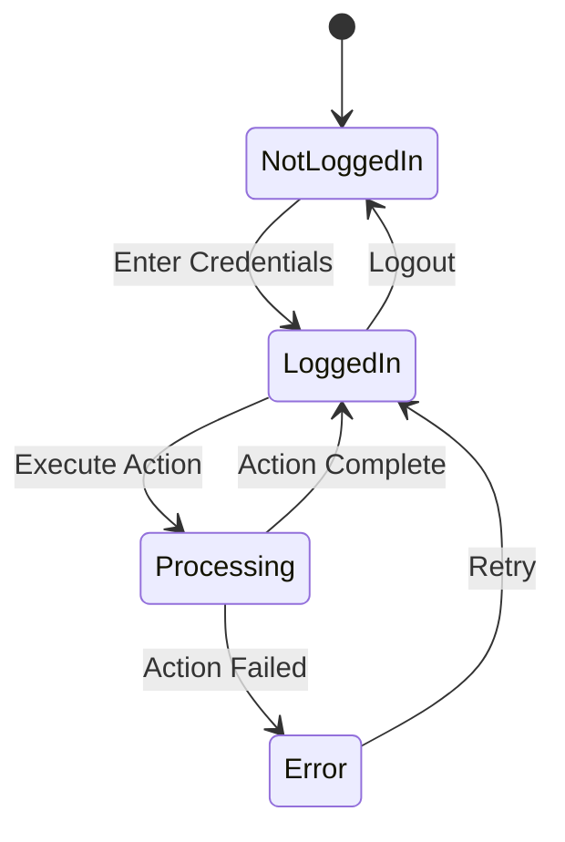
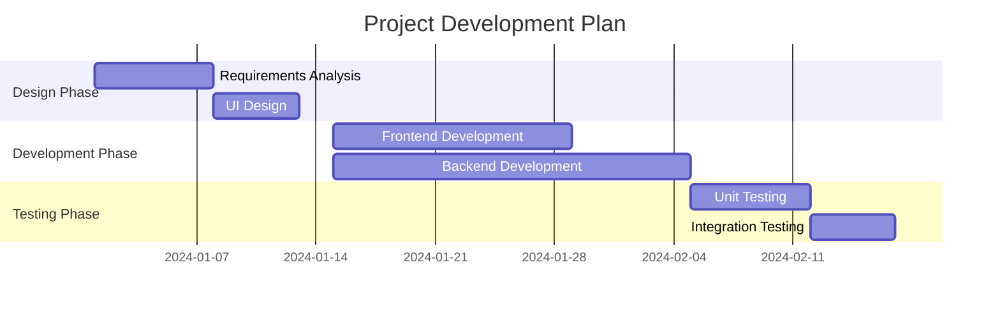
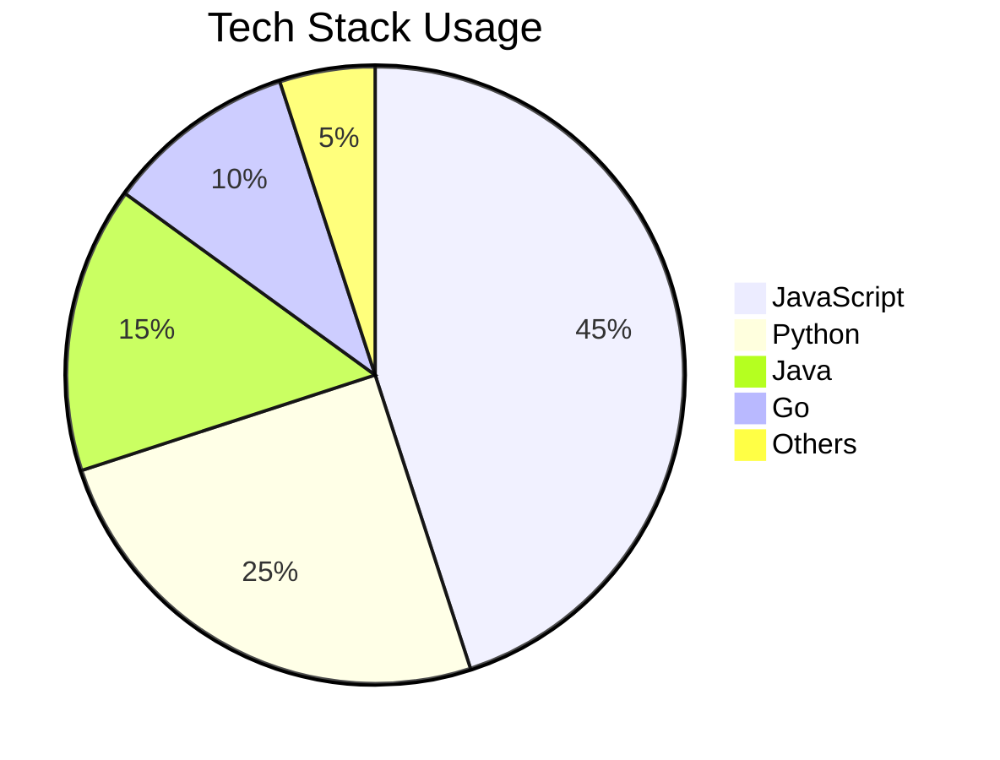
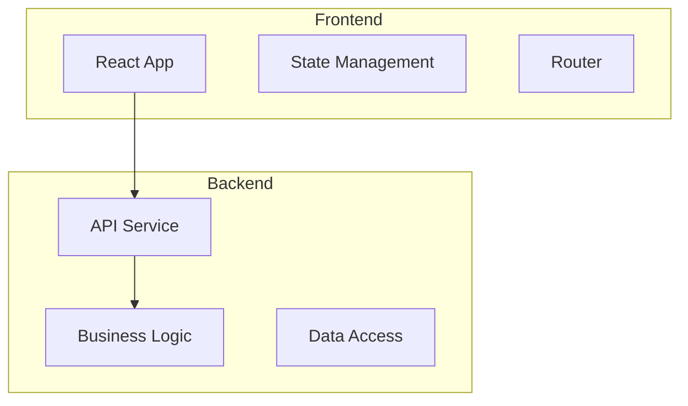

# Mermaid 图表指南

:::tip 摘要
本文介绍如何在 VitePress 中使用 Mermaid 创建各种类型的图表，包括流程图、序列图、甘特图等。
:::

## 目录

[[toc]]

## 什么是 Mermaid？

Mermaid 是一个基于 JavaScript 的图表生成工具，允许您使用简单的文本语法创建复杂的图表和图形。它特别适用于技术文档、流程说明和系统架构设计。

## 基本语法

### 流程图（Flowchart）

### 序列图（Sequence Diagram）

### 类图（Class Diagram）

### 状态图（State Diagram）

### 甘特图（Gantt Chart）

### 饼图（Pie Chart）

## 高级功能

### 子图（Subgraphs）

### 样式定制

## 最佳实践

### 1. 保持简洁
- 避免过于复杂的图表
- 使用清晰的标签和描述
- 合理控制图表大小

### 2. 一致性
- 在整个文档中保持相似的样式
- 使用统一的命名约定
- 保持颜色和形状的一致性

### 3. 可读性
- 使用有意义的节点名称
- 添加必要的注释和说明
- 确保文字大小适中

### 4. 维护性
- 定期检查和更新图表
- 使用版本控制跟踪变更
- 保持代码的可读性

## 常见问题解决

### 图表不显示
1. 检查 Mermaid 语法是否正确
2. 确认代码块标记为 `mermaid`
3. 验证 VitePress 配置是否正确

### 中文显示问题
1. 确保文件编码为 UTF-8
2. 在必要时使用引号包围中文标签
3. 考虑使用英文标签以避免兼容性问题

### 性能优化
1. 避免创建过大的图表
2. 考虑将复杂图表分解为多个小图
3. 在需要时使用懒加载

## 参考资源

- [Mermaid 官方文档](https://mermaid-js.github.io/mermaid/)
- [Mermaid Live Editor](https://mermaid.live/)
- [VitePress Mermaid 插件文档](https://github.com/emersonbottero/vitepress-plugin-mermaid)

通过本指南，您现在应该能够在 VitePress 文档中有效地使用 Mermaid 图表来增强内容的可视化效果。