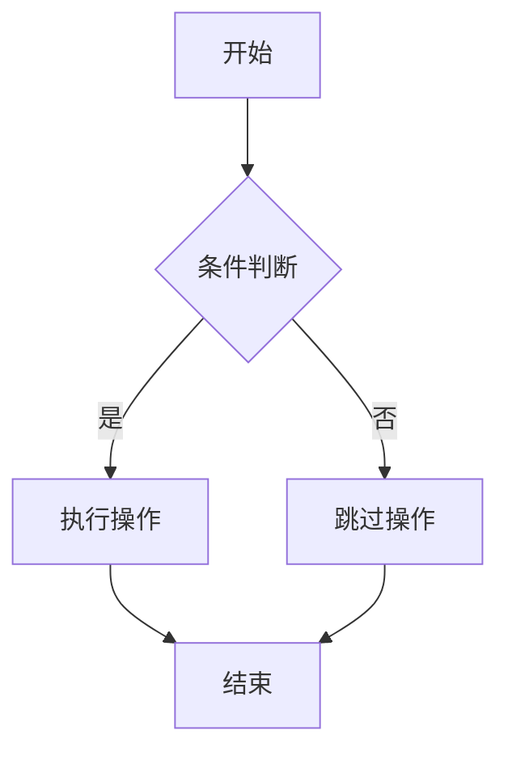
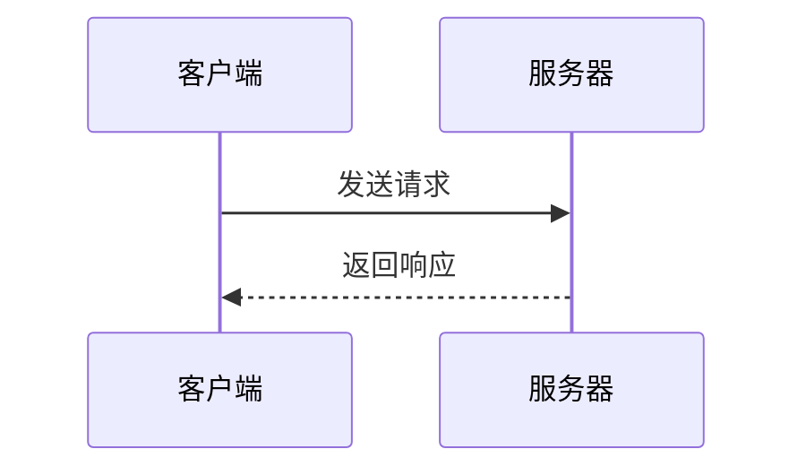
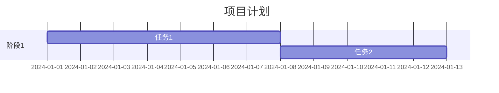

# Markdown 写作指南

本指南详细介绍了在本平台中使用的Markdown语法和高级功能。

## 📝 基础语法

### 标题

```markdown
# 一级标题
## 二级标题
### 三级标题
#### 四级标题
##### 五级标题
###### 六级标题
```

### 文本格式

```markdown
**粗体文本**
*斜体文本*
***粗斜体文本***
~~删除线文本~~
`行内代码`
```

效果展示：
- **粗体文本**
- *斜体文本*
- ***粗斜体文本***
- ~~删除线文本~~
- `行内代码`

### 列表

#### 无序列表
```markdown
- 项目1
- 项目2
  - 子项目1
  - 子项目2
```

#### 有序列表
```markdown
1. 第一项
2. 第二项
   1. 子项目1
   2. 子项目2
```

### 链接和图片

```markdown
[链接文本](https://example.com)

```

### 引用

```markdown
> 这是一个引用
> 可以有多行
> 
> > 嵌套引用
```

效果：
> 这是一个引用
> 可以有多行
> 
> > 嵌套引用

## 🎯 高级功能

### 代码块

支持语法高亮：

````markdown
```javascript
function hello() {
  console.log('Hello, World!')
}
```
````

支持行号显示：

````markdown
```javascript {1,3-5}
function hello() {
  const message = 'Hello, World!'
  console.log(message)
  return message
}
```
````

### 表格

```markdown
| 列1 | 列2 | 列3 |
|-----|:---:|----:|
| 左对齐 | 居中 | 右对齐 |
| 数据1 | 数据2 | 数据3 |
```

效果：
| 列1 | 列2 | 列3 |
|-----|:---:|----:|
| 左对齐 | 居中 | 右对齐 |
| 数据1 | 数据2 | 数据3 |

### 数学公式

#### 行内公式
```markdown
爱因斯坦质能方程：$E = mc^2$
```

#### 块级公式
```markdown
$$
\sum_{i=1}^n x_i = \frac{1}{n}\sum_{i=1}^n x_i
$$
```

## 🎨 VitePress 特有功能

### 自定义容器

```markdown
::: tip 提示
这是一个提示信息
:::

::: info 信息
这是一般信息
:::

::: warning 警告
这是警告信息
:::

::: danger 危险
这是危险警告
:::

::: details 点击展开
这是可折叠的详细信息
:::
```

### 代码组

````markdown
::: code-group

```js [config.js]
export default {
  name: 'config'
}
```

```json [package.json]
{
  "name": "my-project"
}
```

:::
````

### 徽章

```markdown
VitePress <Badge type="info" text="v1.0.0" />
Vue.js <Badge type="tip" text="v3.0+" />
Node.js <Badge type="warning" text="v18+" />
```

### 团队信息

```yaml
---
layout: page
---

<script setup>
import { VPTeamMembers } from 'vitepress/theme'

const members = [
  {
    avatar: 'https://www.github.com/yyx990803.png',
    name: 'Evan You',
    title: 'Creator',
    links: [
      { icon: 'github', link: 'https://github.com/yyx990803' }
    ]
  }
]
</script>

# 团队介绍

<VPTeamMembers size="small" :members="members" />
```

## 📊 Mermaid 图表

VitePress 支持 Mermaid 图表，让您可以使用简单的文本语法创建复杂的图表。

### 流程图

````markdown

````


### 序列图

````markdown

````


### 甘特图

````markdown

````

::: tip 更多图表类型
查看 [Mermaid 图表指南](/articles/mermaid-diagram-guide) 了解更多图表类型和高级用法。
:::

## ✨ 最佳实践

### 文档结构

```markdown
# 主标题

## 概述
简要说明文档内容

## 主要内容
### 小节1
### 小节2

## 总结
要点回顾

## 参考资料
相关链接和资源
```

### 代码示例

- 提供完整、可运行的代码示例
- 添加适当的注释说明
- 使用语法高亮提高可读性

### 视觉元素

- 适当使用表格组织数据
- 利用引用突出重要信息
- 使用容器组件分类不同类型的信息

### 互动性

- 使用折叠容器管理长内容
- 提供代码组展示多种实现方式
- 添加适当的链接增强导航

## 🔧 编辑器配置

### VSCode 扩展推荐

- **Markdown All in One** - 全面的Markdown支持
- **Markdown Preview Enhanced** - 增强的预览功能
- **VitePress Extension** - VitePress特定支持

### 配置示例

```json
{
  "markdown.preview.fontSize": 14,
  "markdown.preview.lineHeight": 1.6,
  "markdown.extension.toc.levels": "2..6"
}
```

---

掌握这些Markdown技巧将帮助您创作出专业、美观的技术文档。继续探索和实践，提升您的写作技能！